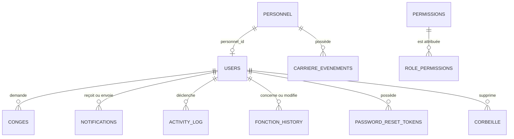

# SGRH — Système de Gestion des Ressources Humaines

Application web de gestion des ressources humaines de l'Université de Mahajanga. SGRH réunit une interface React et une API Express connectée à PostgreSQL.

> Cette documentation est fondée sur le code versionné. Aucun `schema.sql`, migration ou seed n'est présent dans le dépôt : la documentation de la base est déduite des requêtes PostgreSQL réellement utilisées. Les types SQL, index et contraintes non visibles dans ces requêtes ne sont donc pas supposés.

## Architecture

```text
Navigateur → React 19 / Vite / Tailwind → API REST Express → services → repositories → PostgreSQL
```

| Dossier | Responsabilité |
| --- | --- |
| `client/src/pages` | Pages publiques, Admin RH, Superadmin et espace personnel. |
| `client/src/components` | `AppShell`, sidebar, topbar, footer, modal personnel, calendrier et routes protégées. |
| `client/src/context` | Authentification, permissions, thème et textes personnalisables. |
| `client/src/services` | Appels `fetch` vers l'API `/api`. |
| `server/src/routes` | Routes HTTP et gardes d'accès. |
| `server/src/controllers` | Entrées HTTP, validations minimales et réponses. |
| `server/src/services` | Règles métier. |
| `server/src/repositories` | Requêtes PostgreSQL paramétrées. |

## Rôles et fonctionnalités

Les rôles confirmés dans le code sont `SUPERADMIN`, `ADMIN_RH`, `PE` et `PAT`. Les permissions sont stockées en base, chargées dans `PermissionContext`, puis vérifiées une seconde fois par le middleware Express `requirePermission`.

| Rôle | Capacités confirmées |
| --- | --- |
| `SUPERADMIN` | Comptes, désactivation/réactivation, corbeille, permissions et paramètres. |
| `ADMIN_RH` | Tableau de bord, personnel, import/export Excel, invitations, comptes en attente, notifications, fonctions, carrière, congés et historique. |
| `PE` / `PAT` | Dashboard, profil, carrière, congés, notifications, aide et paramètres. |

Fonctionnalités effectivement implémentées : connexion JWT, changement/réinitialisation de mot de passe, OTP e-mail, inscription par matricule avec validation, fiches personnel, recherche/filtres/tri, import/export Excel, liens d'inscription, invitations, congés, carrière, notifications ciblées, comptes, permissions, corbeille, historique et personnalisation de textes/couleurs.

## Installation locale

### Prérequis

- Node.js (la CI utilise Node 22) ;
- PostgreSQL ;
- SMTP compatible avec `server/src/config/mailer.js`.

Copiez les modèles sans versionner les fichiers réels :

```bash
cp client/.env.example client/.env
cp server/.env.example server/.env
```

| Fichier | Variables requises |
| --- | --- |
| `client/.env` | `VITE_API_URL` ; l'API locale par défaut est `http://localhost:4000/api`. |
| `server/.env` | `DB_HOST`, `DB_PORT`, `DB_NAME`, `DB_USER`, `DB_PASSWORD`, `JWT_SECRET`, `PORT`, `FRONTEND_URL`, `GMAIL_USER`, `GMAIL_APP_PASSWORD`. |

```bash
cd client && npm ci && npm run dev
# dans un second terminal
cd server && npm ci && node src/app.js
```

Le client fournit aussi `npm run build`, `npm run preview` et `npm run lint`. Le backend n'a pas de script `start` défini ; son point d'entrée réel est `server/src/app.js` et son port par défaut est `4000`.

## Frontend

Le client est une SPA React 19 créée avec Vite et Tailwind CSS 4. `client/src/App.jsx` centralise les routes. Les pages authentifiées sont contenues dans `AppShell` : sidebar, topbar, contenu et footer.

| Zone | Pages principales |
| --- | --- |
| Publique | Connexion, inscription, OTP, mot de passe oublié et réinitialisation. |
| Admin RH | Dashboard, personnel, invitations, validation de comptes, notifications, fonctions, carrière, congés et historique. |
| Superadmin | Comptes, corbeille et permissions. |
| Personnel | Dashboard, profil, carrière, congés, notifications et aide. |

`AuthContext` enregistre le JWT sous `rh_token` dans `localStorage`, restaure la session via `GET /api/auth/me` et déconnecte l'utilisateur. `ThemeContext` mémorise le thème sous `rh_theme`. `TextContext` charge les textes personnalisables et enregistre leur valeur initiale si absente. `ProtectedRoute` bloque les visiteurs non authentifiés, les rôles non autorisés et les permissions manquantes.

La page Personnel permet la recherche nom/prénom/matricule, les filtres par rôle, fonction, corps, service, direction, contrat et statut, ainsi que le tri, l'import et l'export Excel.

## Backend et sécurité

L'API Express est montée sous `/api`, active CORS et le JSON, puis répond `404` aux routes absentes. La chaîne interne est : **route → controller → service → repository → PostgreSQL**.

1. `POST /api/auth/login` compare le mot de passe avec `bcryptjs`.
2. Le serveur signe un JWT (identifiant et rôle) valable huit heures.
3. Le client le transmet avec `Authorization: Bearer <token>`.
4. `requireAuth` vérifie le jeton et recharge l'utilisateur.
5. `requireRole` ou `requirePermission` applique l'autorisation demandée.

Les repositories emploient des requêtes paramétrées PostgreSQL. Les services portent les règles métier, notamment la validité des dates de congé, les fonctions admises pour PE/PAT, les statuts de compte et les notifications associées.

## Flux métier

### Recherche de personnel

```text
Admin RH → page Personnel → personnelApi.listPersonnel()
→ GET /api/personnel (Bearer JWT)
→ requireAuth + view_personnel
→ controller/service/repository
→ SELECT personnel LEFT JOIN users
→ { personnel: [...] } → recherche, filtres et tri dans React
```

La réponse fournit notamment `a_un_compte`, qui indique si une fiche est reliée à un utilisateur.

### Demande de congé

```text
Personnel → formulaire → POST /api/conges
→ permission create_conge → insertion dans conges
→ notification des Admin RH + activity_log
→ Admin RH : POST /api/conges/:id/review
→ décision, avis, date de revue + notification au demandeur
```

Les demandes ne peuvent pas finir avant leur date de début. Le détail est accessible à son propriétaire ou à un `ADMIN_RH`.

### Inscription par matricule

```text
Fiche personnel → lien d'inscription → POST /api/register
→ contrôle e-mail/matricule et mot de passe → users.status = pending
→ notification des Admin RH → approbation ou refus
```

Une voie distincte d'invitation par jeton existe également : invitation, formulaire, confirmation ou refus par l'Admin RH.

## API REST

Les réponses sont JSON, sauf l'export Excel. Toutes les routes listées comme protégées attendent un jeton Bearer.

### Authentification et inscription

| Méthode | URL | Accès | Objectif |
| --- | --- | --- | --- |
| POST | `/api/auth/login` | Public | `{ email, password }` → jeton et utilisateur. |
| GET | `/api/auth/me` | Authentifié | Utilisateur courant. |
| PATCH | `/api/auth/password` | Authentifié | Change le mot de passe. |
| POST | `/api/auth/forgot-password` | Public | Envoie le lien de réinitialisation. |
| POST | `/api/auth/reset-password` | Public | Réinitialise avec jeton et nouveau mot de passe. |
| POST | `/api/otp/request`, `/api/otp/verify` | Public | Envoie puis vérifie un code e-mail. |
| POST | `/api/register` | Public | Inscription `{ email, matricule, password }` en attente. |

### Personnel, comptes et invitations

| Méthode | URL | Accès | Objectif |
| --- | --- | --- | --- |
| GET / POST | `/api/personnel` | `view_personnel` / `create_personnel` | Liste ou crée une fiche. |
| GET | `/api/personnel/me` | `view_profil` | Fiche de l'utilisateur courant. |
| GET | `/api/personnel/sans-compte` | `send_registration_link` | Personnel sans compte. |
| POST | `/api/personnel/:id/envoyer-lien` | `send_registration_link` | Lien d'inscription par e-mail. |
| GET / POST | `/api/personnel/export`, `/api/personnel/import` | `view_personnel` / `create_personnel` | Export Excel / import multipart `file` (5 Mo maximum). |
| GET / POST | `/api/pending-accounts`, `/:id/approve`, `/:id/reject` | `view_pending_accounts` | Liste et traite les comptes en attente. |
| GET / POST / DELETE | `/api/account-admin`, `/:id/deactivate`, `/:id/reactivate`, `/:id` | `manage_accounts` | Gestion des comptes et corbeille. |
| POST | `/api/invitations` | `ADMIN_RH` | Invitation avec e-mail, rôle, fonction, matricule. |
| GET | `/api/invitations/pending` | `ADMIN_RH` | Invitations soumises. |
| GET / POST | `/api/invitations/:token`, `/:token/submit` | Public | Lecture et soumission d'invitation. |
| POST | `/api/invitations/:id/confirm`, `/:id/reject` | `ADMIN_RH` | Décision sur une invitation. |

### Congés, carrière et administration

| Méthode | URL | Accès | Objectif |
| --- | --- | --- | --- |
| POST / GET | `/api/conges`, `/api/conges/me` | `create_conge` / `view_mes_conges` | Crée et liste ses congés. |
| GET | `/api/conges/pending`, `/recent`, `/calendar` | `view_conges_admin` | Pilotage RH des congés. |
| GET / POST | `/api/conges/:id`, `/:id/review` | Propriétaire/Admin RH / `view_conges_admin` | Détail et décision. |
| GET | `/api/carriere/me` | `view_profil` | Carrière personnelle. |
| GET / POST | `/api/carriere/:personnelId` | `manage_fonctions` | Carrière et événement. |
| GET | `/api/carriere/echeances` | `manage_fonctions` | Contrats arrivant à échéance sous 30 jours. |
| PATCH / GET | `/api/users/:id/fonction`, `/:id/fonction-history` | `manage_fonctions` | Fonction et son historique. |
| GET | `/api/activity-log?limit=` | `view_historique` | Journal des actions. |
| GET | `/api/stats/admin-dashboard` | `view_dashboard_admin` | Indicateurs RH. |
| POST / GET | `/api/notifications`, `/api/notifications/me` | `send_notification` / `view_notifications` | Envoi ciblé et réception. |
| POST | `/api/notifications/:id/read` | `view_notifications` | Marque sa notification comme lue. |
| GET / PATCH | `/api/permissions`, `/api/permissions/me` | `manage_permissions` / authentifié | Gère ou lit les permissions. |
| GET / POST / DELETE | `/api/corbeille`, `/:id/restaurer`, `/:id` | `manage_corbeille` | Corbeille et restauration de comptes. |
| GET / PATCH | `/api/site-settings` | Public / `manage_site_settings` | Couleurs du site. |
| GET / POST / PATCH | `/api/site-texts`, `/ensure-default`, `/` | Public / `manage_site_texts` | Textes personnalisables. |

## Structure de la base de données

`user_details` est interrogée comme une vue ou une table de lecture : sa définition n'est pas dans le dépôt. Les relations ci-dessous sont celles utilisées dans le code.



| Table / vue | Colonnes observées et rôle |
| --- | --- |
| `personnel` | `id`, matricule, identité, e-mail, rôle, fonction, corps, grade, service, direction, téléphone, contrat, échéance. Fiche RH ; matricule validé à six chiffres par l'application. |
| `users` | `id`, rôle, e-mail, `password_hash`, `personnel_id`, statut, création. Statuts observés : `pending`, `active`, `inactive`. |
| `user_details` | Lecture jointe compte/personnel : identité, matricule, rôle, fonction, statut, e-mail et contrat. |
| `conges` | Identifiant utilisateur, type, dates, motif, statut, relecteur, date/avis de revue. Statuts : `en_attente`, `approuvee`, `refusee`. |
| `invitations` | E-mail, rôle, fonction, jeton, émetteur, expiration, statut, données soumises, utilisateur créé. Statuts : `envoyee`, `soumise`, `confirmee`, `refusee`. |
| `notifications` | Expéditeur, destinataire, titre, message, type, lecture et date. |
| `fonction_history` / `carriere_evenements` | Historique de fonction et événements de carrière. |
| `activity_log` | Utilisateur, type d'action, description, date ; l'utilisateur peut être nul. |
| `permissions` / `role_permissions` | Catalogue et association rôle/permission avec indicateur `enabled`. L'upsert repose sur l'unicité fonctionnelle `(role, permission_id)`. |
| `otp_codes` | E-mail, code, expiration, utilisation ; validité de dix minutes. |
| `password_reset_tokens` | Utilisateur, jeton, expiration, utilisation ; validité de trente minutes. |
| `corbeille` | Type, données JSON, auteur et date de suppression. |
| `site_settings` / `site_texts` | Paires clé/valeur pour couleurs et textes ; textes catégorisés. |

Relations utilisées : `users.personnel_id → personnel.id`, `conges.user_id → users.id`, `notifications.sender_id/recipient_id → users.id`, `fonction_history.user_id/changed_by → users.id`, `carriere_evenements.personnel_id → personnel.id`, `role_permissions.permission_id → permissions.id` et les jetons de mot de passe vers `users.id`.

Les clés primaires déclarées, types SQL exacts, `NOT NULL`, clés étrangères, index et contraintes `UNIQUE` ne sont pas vérifiables sans le schéma absent. Ils devront être formalisés dans des migrations pour permettre une installation de base de données reproductible.

## Qualité et CI

GitHub Actions s'exécute sur chaque push et pull request vers `main` : `npm ci` dans les deux applications, build du frontend et vérification syntaxique de tous les fichiers backend avec `node --check`.

Le dépôt ne contient pas de tests automatisés ni de déploiement configuré. GitHub Pages ne peut pas héberger Express et PostgreSQL ; un futur hébergeur doit utiliser des GitHub Actions Secrets pour ses identifiants, jamais des secrets commités.
