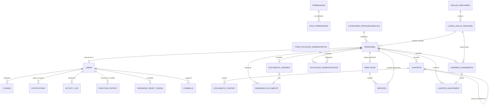

# SGRH — Système de Gestion des Ressources Humaines

Application web de gestion des ressources humaines de l'Université de Mahajanga. SGRH réunit une interface React et une API Express connectée à PostgreSQL.

> Cette documentation est fondée sur le code versionné. Le schéma des tables historiques (`personnel`, `users`, `conges`...) n'a pas de fichier `schema.sql` ni de seed dans le dépôt : leur documentation reste déduite des requêtes PostgreSQL réellement utilisées. Les tables ajoutées depuis (`contrats`, `documents_contrat`, `situations_administratives`, `types_situation_administrative`) sont en revanche définies par des migrations versionnées et documentées avec certitude.

## Architecture

```text
Navigateur → React 19 / Vite / Tailwind → API REST Express → services → repositories → PostgreSQL
```

| Dossier | Responsabilité |
| --- | --- |
| `client/src/pages` | Pages publiques, Admin RH, Superadmin et espace personnel. |
| `client/src/components` | `AppShell`, sidebar (tiroir mobile inclus), topbar, footer, `PageHeader` (fil d'Ariane), composants `settings/*`, modal personnel, calendrier et routes protégées. |
| `client/src/context` | Authentification, permissions, thème, préférences d'affichage (`SettingsPreferencesContext`) et textes personnalisables. |
| `client/src/services` | Appels `fetch` vers l'API `/api`. |
| `server/src/routes` | Routes HTTP et gardes d'accès. |
| `server/src/controllers` | Entrées HTTP, validations minimales et réponses. |
| `server/src/services` | Règles métier. |
| `server/src/repositories` | Requêtes PostgreSQL paramétrées. |
| `server/migrations` | Migrations SQL versionnées, numérotées et idempotentes (`001` à `005`). |

## Rôles et fonctionnalités

Les rôles confirmés dans le code sont `SUPERADMIN`, `ADMIN_RH`, `PE` et `PAT`. Les permissions sont stockées en base, chargées dans `PermissionContext`, puis vérifiées une seconde fois par le middleware Express `requirePermission`.

| Rôle | Capacités confirmées |
| --- | --- |
| `SUPERADMIN` | Reçoit exactement le menu Admin RH, plus un bloc exclusif : gestion des comptes, désactivation/réactivation, corbeille, rôles & permissions, apparence du site. |
| `ADMIN_RH` | Tableau de bord, personnel, import/export Excel, invitations, comptes en attente, envoi de notifications, fonctions, carrière, situation administrative, **contrats**, congés, documents administratifs, demandes de documents et audit/journal. |
| `PE` / `PAT` | Tableau de bord, mon dossier (profil), carrière, **mes contrats**, congés & absences, mes documents, notifications, aide et paramètres. Le profil/les paramètres restent accessibles uniquement via le menu utilisateur de la TopBar, pas dans la sidebar. |

Fonctionnalités effectivement implémentées : connexion JWT, changement/réinitialisation de mot de passe, OTP e-mail, inscription par matricule avec validation, fiches personnel, recherche/filtres/tri, import/export Excel, liens d'inscription, invitations, congés, carrière, **situation administrative (avec motif, une seule situation ouverte à la fois, modification, et suppression limitée à la situation en cours)**, **gestion complète des contrats** (import PDF, historique, renouvellement avec renégociation, non-renouvellement motivé, avenants, alerte d'échéance à 183 jours puis notification d'expiration), notifications ciblées **avec lien de navigation direct et « tout marquer comme lu »**, comptes, permissions, **suppression de compte réversible via une corbeille transactionnelle**, historique et personnalisation de textes/couleurs/préférences d'affichage.

## Installation locale

### Prérequis

- Node.js (la CI utilise Node 22) ;
- PostgreSQL ;
- SMTP compatible avec `server/src/config/mailer.js`.

Copiez les modèles sans versionner les fichiers réels :

```bash
cp client/.env.example client/.env
cp server/.env.example server/.env
```

| Fichier | Variables requises |
| --- | --- |
| `client/.env` | `VITE_API_URL` ; l'API locale par défaut est `http://localhost:4000/api`. |
| `server/.env` | `DB_HOST`, `DB_PORT`, `DB_NAME`, `DB_USER`, `DB_PASSWORD`, `JWT_SECRET`, `PORT`, `FRONTEND_URL`, `GMAIL_USER`, `GMAIL_APP_PASSWORD`. |

Sur une base existante, appliquez les migrations dans l'ordre (chacune est réexécutable sans risque) :

```bash
for f in server/migrations/*.sql; do psql -d "$DB_NAME" -f "$f"; done
```

```bash
cd client && npm ci && npm run dev
# dans un second terminal
cd server && npm ci && node src/app.js
```

Le client fournit aussi `npm run build`, `npm run preview` et `npm run lint`. Le backend n'a pas de script `start` défini ; son point d'entrée réel est `server/src/app.js` et son port par défaut est `4000`. Au démarrage, le serveur lance aussi une vérification périodique des échéances de contrat (`contratEcheanceJob`, toutes les 24h après un premier passage à 30 secondes).

## Frontend

Le client est une SPA React 19 créée avec Vite et Tailwind CSS 4. `client/src/App.jsx` centralise les routes. Les pages authentifiées sont contenues dans `AppShell` : sidebar, topbar, contenu et footer. Sur écran large, le shell occupe la hauteur de la fenêtre : la sidebar et la topbar restent visibles, tandis que seule la zone principale défile.

Sous le seuil `lg` (1024px), la sidebar devient un tiroir superposé fermé par défaut : un bouton hamburger apparaît dans la TopBar, un fond assombri couvre le contenu, et le tiroir se ferme au clic sur ce fond, à la touche `Échap` ou après un clic sur un lien de navigation. À partir de `lg`, le comportement redevient statique.

La navigation latérale affiche uniquement les entrées autorisées par rôle et permission, regroupées par thème (Personnel, Carrière, Documents, Utilisateurs & comptes...). Le Super Admin voit le menu Admin RH complet, prolongé par un groupe « Super Administration » exclusif — ce n'est pas une sidebar différente. L'accès au compte est regroupé dans l'avatar de la TopBar : le menu affiche le nom (ou l'e-mail en repli), le rôle, les paramètres et la déconnexion. Pour les rôles `PE` et `PAT` disposant de `view_profil`, il inclut également le lien vers `/profil`. Le menu se ferme au clic extérieur, avec la touche `Escape` ou après le choix d'une action. La déconnexion réutilise `AuthContext.logout()`, qui supprime `rh_token` du `localStorage` et vide l'utilisateur courant ; aucune route ou API supplémentaire n'est impliquée.

Chaque page affiche un en-tête cohérent via le composant réutilisable `PageHeader` (fil d'Ariane + titre + sous-titre), et les listes/formulaires exploitent la largeur disponible (grilles à deux colonnes plutôt que des colonnes étroites centrées) plutôt que de laisser de l'espace vide sur les grands écrans.

| Zone | Pages principales |
| --- | --- |
| Publique | Connexion, inscription, OTP, mot de passe oublié et réinitialisation. |
| Admin RH | Tableau de bord, personnel, carrière (fonctions, paramètres carrière **+ grilles indiciaires**), **contrats**, congés & absences, documents (administratifs, demandes), utilisateurs & comptes (invitations, comptes en attente), envoyer une notification, audit & journal. |
| Superadmin | Gestion des comptes, corbeille, rôles & permissions, apparence. |
| Personnel | Tableau de bord, mon dossier, ma carrière, **mes contrats**, mes congés & absences, mes documents, mon équipe / validation équipe (chefs de service), aide. |

`AuthContext` enregistre le JWT sous `rh_token` dans `localStorage`, restaure la session via `GET /api/auth/me` et déconnecte l'utilisateur. `ThemeContext` mémorise le thème sous `rh_theme`. `SettingsPreferencesContext` mémorise sous `rh_settings_prefs` les préférences d'affichage (densité, taille du texte, mode sidebar, animations, accessibilité, notifications app/e-mail, langue, préférences de tableaux et de documents) — entièrement côté client, aucune API dédiée. `TextContext` charge les textes personnalisables et enregistre leur valeur initiale si absente. `ProtectedRoute` bloque les visiteurs non authentifiés, les rôles non autorisés et les permissions manquantes.

La page Personnel permet la recherche nom/prénom/matricule, les filtres par rôle, fonction, corps, service, direction, contrat et statut, ainsi que le tri, l'import et l'export Excel.

### Paramètres

La page `/parametres` regroupe cinq catégories filtrées par rôle et permission : **Compte** (profil et compte, sécurité, sessions), **Préférences** (apparence, notifications, langue & région, accessibilité), **Données** (préférences des tableaux, documents), **Administration** (redirections vers Personnel, Carrière, Utilisateurs, Rôles & permissions, Journal d'activité — pas de logique dupliquée, juste un raccourci), et **Système** (fonctionnalités, maintenance, réservés au Super Admin). Les préférences réellement fonctionnelles (thème, densité, notifications, tableaux, documents) sont persistées via `SettingsPreferencesContext` ; les éléments qui nécessiteraient une API dédiée (déconnecter les autres sessions, mode maintenance) sont présentés à l'état visuel, désactivés, sans fausse fonctionnalité.

### Dossier personnel

La route `/profil` (« Mon dossier » dans la navigation) présente le dossier de la personne connectée : une bannière d'identité (photo, statut, matricule/fonction/catégorie), puis deux grilles d'informations personnelles et administratives, puis une carte « Établissements d'affectation » (toujours vide : aucune donnée d'établissement n'existe dans le modèle actuel) et enfin le parcours professionnel. Les données proviennent de `GET /api/personnel/me` et `GET /api/carriere/me` ; toute donnée absente est affichée comme « Non renseigné ».

La personne peut remplacer sa photo depuis ce dossier. L'image est prévisualisée avant confirmation, puis envoyée à `PATCH /api/personnel/me/photo`. Le serveur n'accepte que les signatures binaires JPEG, PNG ou WebP, dans une limite de 3 Mo ; il génère un nom non prédictible et ne persiste en base que le chemin relatif du fichier. Les fichiers sont stockés localement dans `server/uploads/profile-photos/` (ignoré par Git) et servis sous `/uploads`.

### Contrats

Deux pages distinctes, séparées de la carrière : `/mes-contrats` (personnel, lecture seule) et `/admin/contrats` (RH, gestion complète — import, décision, renouvellement, avenants). La page RH accepte un paramètre `?personnel=<id>` pour présélectionner un employé, utilisé par les liens de notification d'échéance. Les PDF de contrat sont stockés hors de `express.static`, dans `server/private-uploads/contrats/` (ignoré par Git, à ajouter explicitement si absent), sous un nom UUID non prédictible ; leur téléchargement passe par une route authentifiée qui vérifie que le demandeur est le propriétaire du contrat ou un `ADMIN_RH`.

### Grilles indiciaires (frontend)

Sur `/admin/carriere`, quand l'employé sélectionné a `corps = 'Fonctionnaire'`, le formulaire d'événement remplace les champs libres classe/échelon/indice par `GrilleIndiciaireSelector` (`client/src/components/GrilleIndiciaireSelector.jsx`) : sélection classe/échelon/catégorie, résolution automatique de l'indice via `GET /api/indiciaire/resolve`, source réglementaire affichée. Si aucune ligne ne correspond, un bandeau « à confirmer » réactive une saisie manuelle — jamais bloquant. Ce même composant est réutilisé dans `ModifierEmployeModal.jsx`. Un bloc « Alertes avancement » liste les échéances d'échelon ouvertes pour l'employé sélectionné, avec un traitement en un clic. La page « Paramètres carrière » gagne un onglet « Grilles indiciaires » (lecture des grilles/lignes existantes + ajout RH d'une ligne, source obligatoire) — pas de nouvelle entrée de sidebar, elle reste dans le groupe « Carrière » existant. `MaCarriere.jsx`/`Profil.jsx` affichent l'indice au format `950-FOP` (générique, jamais `FOP` en dur) avec sa source quand disponible.

## Backend et sécurité

L'API Express est montée sous `/api`, active CORS et le JSON, puis répond `404` aux routes absentes. La chaîne interne est : **route → controller → service → repository → PostgreSQL**.

1. `POST /api/auth/login` compare le mot de passe avec `bcryptjs`.
2. Le serveur signe un JWT (identifiant et rôle) valable huit heures.
3. Le client le transmet avec `Authorization: Bearer <token>`.
4. `requireAuth` vérifie le jeton et recharge l'utilisateur.
5. `requireRole` ou `requirePermission` applique l'autorisation demandée.

Les repositories emploient des requêtes paramétrées PostgreSQL. Les services portent les règles métier, notamment la validité des dates de congé, les fonctions admises pour PE/PAT, les statuts de compte et les notifications associées.

La suppression d'un compte (`DELETE /api/account-admin/:id`) est transactionnelle et réversible : `corbeilleRepository.archiveAndDeleteCompte` capture le compte et tout ce qui lui appartient substantiellement (congés, historique de fonction, notifications reçues) dans la corbeille avant de le supprimer ; `restoreCompte` recrée ces lignes avec leurs identifiants d'origine. Les autres tables qui ne font que référencer l'utilisateur comme auteur d'une action (`activity_log`, `carriere_evenements`, `documents_generes`...) passent à `NULL` automatiquement grâce aux contraintes `ON DELETE` posées par la migration `002` et restent intactes.

## Flux métier

### Recherche de personnel

```text
Admin RH → page Personnel → personnelApi.listPersonnel()
→ GET /api/personnel (Bearer JWT)
→ requireAuth + view_personnel
→ controller/service/repository
→ SELECT personnel LEFT JOIN users
→ { personnel: [...] } → recherche, filtres et tri dans React
```

La réponse fournit notamment `a_un_compte`, qui indique si une fiche est reliée à un utilisateur.

### Demande de congé

```text
Personnel → formulaire → POST /api/conges
→ permission create_conge → insertion dans conges
→ notification des Admin RH + activity_log
→ Admin RH : POST /api/conges/:id/review
→ décision, avis, date de revue + notification au demandeur
```

Les demandes ne peuvent pas finir avant leur date de début. Le détail est accessible à son propriétaire ou à un `ADMIN_RH`.

### Inscription par matricule

```text
Fiche personnel → lien d'inscription → POST /api/register
→ contrôle e-mail/matricule et mot de passe → users.status = pending
→ notification des Admin RH → approbation ou refus
```

Une voie distincte d'invitation par jeton existe également : invitation, formulaire, confirmation ou refus par l'Admin RH.

### Cycle de vie d'un contrat

```text
Admin RH → import initial (PDF + type/dates) → POST /api/contrats/personnel/:personnelId
→ contrat "actif", numero_renouvellement = 0

183 jours avant date_fin → contratEcheanceJob.verifierEcheances()
→ notification au personnel + notification (rôle ADMIN_RH), notifie_echeance_le horodaté (anti-doublon)

Admin RH décide :
  "Renouveler (renégociation)"  → POST /:contratId/decision → statut inchangé, décision mémorisée
    → finalisation après signature → POST /personnel/:personnelId/:contratId/renouveler
    → nouveau contrat (numero_renouvellement + 1, contrat_precedent_id), ancien passe à "renouvele"
    → notification "Contrat renouvelé" au personnel
  "Ne pas renouveler" (motif obligatoire) → POST /:contratId/decision
    → statut "non_renouvele" → notification "Non-renouvellement de contrat" au personnel (motif réel, jamais inventé)

Si aucune décision n'est prise avant la date de fin → contratEcheanceJob.verifierExpirations()
→ notification "Contrat expiré" (personnel) + "Contrat expiré sans décision" (ADMIN_RH), notifie_expiration_le horodaté
```

Aucun contrat ni document n'est jamais supprimé par l'application. Les notifications liées à un contrat portent un champ `lien` (`/mes-contrats` ou `/admin/contrats?personnel=<id>`) qui permet à la cloche de notifications de rediriger directement vers la bonne page.

### Situation administrative

```text
Admin RH → nouvelle situation (type, date_debut, motif, référence, justificatif) → POST /api/situations-administratives/:personnelId
→ si une situation est déjà ouverte pour ce personnel, elle est fermée automatiquement (date_fin = nouvelle date_debut)
→ notification au personnel concerné, avec le libellé réel de la nouvelle situation
```

Une situation déjà close ne peut pas être supprimée (`DELETE /api/situations-administratives/:id` renvoie 400) — seule la situation actuelle (non close) peut l'être, et sa suppression rouvre automatiquement la situation qu'elle avait fermée, pour préserver la continuité de la chronologie.

## Grilles indiciaires et carrière

L'indice de traitement d'un fonctionnaire n'est jamais une valeur saisie librement : il est **déterminé** par `grilleIndiciaireService.resolveIndice()` (logique centralisée, jamais dupliquée) à partir d'une grille réglementaire et de la situation de l'agent (classe, échelon, catégorie/cadre/échelle, date d'effet). Cette règle ne s'applique qu'au régime `FONCTIONNAIRE` (déduit de `personnel.corps = 'Fonctionnaire'` — voir note terminologique ci-dessous) ; pour les agents non encadrés (`EFA`/`ELD`), aucune grille chiffrée n'a pu être vérifiée par une source officielle, donc aucune n'est codée en dur : leur indice reste en saisie libre (`indice_source = 'A_CONFIRMER'`).

### Sources réglementaires vérifiées

| Texte | Ce qu'il fixe |
| --- | --- |
| Loi n°2003-011 du 03/09/2003 (Statut Général des Fonctionnaires), Art.3/34/45-49 | Corps → 4 cadres (A/B/C/D), 2 à 4 échelles par cadre ; à cadre/échelle/classe/échelon égaux l'indice est identique dans tous les cadres ; avancement = échelon (automatique après 2 ans d'ancienneté) + classe (au mérite, tableau annuel après avis de la Commission Administrative Paritaire) ; 4 classes : classe exceptionnelle (2 échelons), principalat/1ère/2ème classe (3 échelons chacune). |
| Décret n°2005-134 du 15/03/2005 + Circulaire n°132/MFPTLS du 01/06/2005 | Mécanisme de **reclassement indiciaire étroit** (pas une règle générale) : réservé au fonctionnaire ayant 2 ans dans le 2e échelon de la classe exceptionnelle, proche de la retraite. Donne un tableau chiffré réel (catégories transitoires I à X) repris tel quel dans le seed de la migration `006`. |
| Décret n°97-009 du 16/01/1997 | Indices de traitement de la classe exceptionnelle (1er/2e échelon), régime transitoire par catégorie — seule donnée numérique intégralement vérifiée à ce jour. |
| Décret n°96-745 du 27/08/1996 | Structure cadre → échelle (A→A1/A2/A3, B→B1/B2, C→C1/C2, D→D1/D2/D3), antérieure à la loi 2003-011. |

**Point non résolu, documenté plutôt que deviné** : la Circulaire 132/2005 indique elle-même qu'en juin 2005 le décret de classement hiérarchique cadre/échelle et la grille indiciaire complète prévus par la loi 2003-011 n'étaient pas encore adoptés. Aucun texte postérieur confirmant cette transition n'a été localisé. En conséquence, seule la classe exceptionnelle (régime transitoire par catégorie I-X) est peuplée en base ; le principalat, la première classe et la deuxième classe restent des combinaisons valides *structurellement* (contrainte SQL) mais sans ligne d'indice tant qu'aucune source fiable ou confirmation RH n'est fournie. Le sigle « FOP » n'a été trouvé défini dans aucun texte officiel consulté et n'est jamais codé en dur : `lignes_grille_indiciaire.code_grille_affichage` reste un champ générique et optionnel.

**Note terminologique** : `personnel.corps` (`CHECK IN ('EFA','ELD','Fonctionnaire')`) sert dans ce projet de marqueur de *régime* (agent non encadré vs. fonctionnaire), et non de « corps » au sens réglementaire strict (ex. un corps précis d'enseignants-chercheurs). `lignes_grille_indiciaire.corps` est un champ distinct, réservé à un futur texte réellement corps-spécifique.

### Modèle de données

- **`grilles_indiciaires`** : une grille par régime/période de validité, avec sa source réglementaire obligatoire.
- **`lignes_grille_indiciaire`** : une ligne = un indice pour `(cadre, échelle) | catégorie | corps` × `classe` × `échelon`, avec sa propre source/article. Un `CHECK` SQL encode directement la Loi 2003-011 Art.46 (2 échelons en classe exceptionnelle, 3 pour les autres) : une combinaison réglementairement impossible est rejetée en base, pas seulement côté applicatif.
- **`personnel`** et **`carriere_evenements`** gagnent (migration `007`, additive) : `indice_num` (entier, la valeur exploitable — la colonne texte `indice` reste pour l'affichage legacy "950-FOP"), `indice_source` (`REGLEMENTAIRE`/`SAISIE_RH`/`IMPORT_EXCEL`/`A_CONFIRMER`), `ligne_grille_id`/`ligne_grille_actuelle_id` (traçabilité vers la ligne de grille utilisée), `cadre`/`echelle`. Après chaque création/modification/suppression d'un événement de carrière portant une situation, `carriereService` resynchronise automatiquement `personnel` sur l'événement le plus récent (par date d'effet) : la fiche personnel ne peut pas diverger silencieusement de son historique.
- **`alertes_avancement`** (migration `008`) : file d'alertes RH (`AVANCEMENT_ECHELON_ECHU`, `AVANCEMENT_CLASSE_ELIGIBLE`, `INCOHERENCE_INDICE`, `GRILLE_INCONNUE`, `DOSSIER_INCOMPLET`), jamais d'écriture automatique sur `personnel`/`carriere_evenements` — seulement une alerte à traiter par le RH.

### Flux : avancement d'échelon

```text
avancementEcheanceJob (toutes les 24h, comme contratEcheanceJob) → avancementService.scannerAlertes()
→ pour chaque agent régime FONCTIONNAIRE : date d'entrée dans l'échelon actuel + périodicité (paramètre
  "avancement_echelon_periodicite_annees", 2 ans par défaut, Art.47) = échéance théorique
→ si échéance atteinte : crée une alertes_avancement OUVERTE (anti-doublon par index unique partiel) + notifie l'ADMIN_RH
→ RH consulte /api/carriere/alertes-avancement, choisit "Traiter" avec la catégorie/cadre-échelle réels
→ PATCH /api/carriere/alertes-avancement/:id/traiter → resolveIndice() → nouveau carriere_evenements
  (type "Avancement d'échelon", indice_source=REGLEMENTAIRE) → personnel resynchronisé → alerte marquée TRAITEE
```

L'éligibilité théorique (date atteinte) est donc toujours distincte du traitement administratif (validation RH) et de la situation effective (nouvel événement) — jamais de changement silencieux de l'indice d'un agent.

## API REST

Les réponses sont JSON, sauf l'export Excel et le téléchargement de documents/contrats. Toutes les routes listées comme protégées attendent un jeton Bearer.

### Authentification et inscription

| Méthode | URL | Accès | Objectif |
| --- | --- | --- | --- |
| POST | `/api/auth/login` | Public | `{ email, password }` → jeton et utilisateur. |
| GET | `/api/auth/me` | Authentifié | Utilisateur courant. |
| PATCH | `/api/auth/password` | Authentifié | Change le mot de passe. |
| POST | `/api/auth/forgot-password` | Public | Envoie le lien de réinitialisation. |
| POST | `/api/auth/reset-password` | Public | Réinitialise avec jeton et nouveau mot de passe. |
| POST | `/api/otp/request`, `/api/otp/verify` | Public | Envoie puis vérifie un code e-mail. |
| POST | `/api/register` | Public | Inscription `{ email, matricule, password }` en attente. |

### Personnel, comptes et invitations

| Méthode | URL | Accès | Objectif |
| --- | --- | --- | --- |
| GET / POST | `/api/personnel` | `view_personnel` / `create_personnel` | Liste ou crée une fiche. |
| GET | `/api/personnel/me` | `view_profil` | Fiche de l'utilisateur courant. |
| PATCH | `/api/personnel/me/photo` | `view_profil` | Enregistre la photo personnelle multipart `photo` (JPG/PNG/WebP, 3 Mo maximum). |
| GET | `/api/personnel/sans-compte` | `send_registration_link` | Personnel sans compte. |
| POST | `/api/personnel/:id/envoyer-lien` | `send_registration_link` | Lien d'inscription par e-mail. |
| GET / POST | `/api/personnel/export`, `/api/personnel/import` | `view_personnel` / `create_personnel` | Export Excel / import multipart `file` (5 Mo maximum). |
| GET / POST | `/api/pending-accounts`, `/:id/approve`, `/:id/reject` | `view_pending_accounts` | Liste et traite les comptes en attente. |
| GET / POST / DELETE | `/api/account-admin`, `/:id/deactivate`, `/:id/reactivate`, `/:id` | `manage_accounts` | Gestion des comptes ; la suppression est transactionnelle et réversible (voir Backend et sécurité). |
| POST | `/api/invitations` | `ADMIN_RH` | Invitation avec e-mail, rôle, fonction, matricule. |
| GET | `/api/invitations/pending` | `ADMIN_RH` | Invitations soumises. |
| GET / POST | `/api/invitations/:token`, `/:token/submit` | Public | Lecture et soumission d'invitation. |
| POST | `/api/invitations/:id/confirm`, `/:id/reject` | `ADMIN_RH` | Décision sur une invitation. |

### Congés, carrière et administration

| Méthode | URL | Accès | Objectif |
| --- | --- | --- | --- |
| POST / GET | `/api/conges`, `/api/conges/me` | `create_conge` / `view_mes_conges` | Crée et liste ses congés. |
| GET | `/api/conges/pending`, `/recent`, `/calendar` | `view_conges_admin` | Pilotage RH des congés. |
| GET / POST | `/api/conges/:id`, `/:id/review` | Propriétaire/Admin RH / `view_conges_admin` | Détail et décision. |
| GET | `/api/carriere/me` | `view_profil` | Carrière personnelle. |
| GET / POST | `/api/carriere/:personnelId` | `manage_fonctions` | Carrière et événement. |
| GET | `/api/carriere/echeances` | `manage_fonctions` | Personnel dont `date_echeance_contrat` (champ historique, distinct des contrats ci-dessous) tombe sous 30 jours. |
| PATCH / GET | `/api/users/:id/fonction`, `/:id/fonction-history` | `manage_fonctions` | Fonction et son historique. |
| GET | `/api/activity-log?limit=` | `view_historique` | Journal des actions. |
| GET | `/api/stats/admin-dashboard` | `view_dashboard_admin` | Indicateurs RH. |
| POST / GET | `/api/notifications`, `/api/notifications/me` | `send_notification` / `view_notifications` | Envoi ciblé et réception. |
| POST | `/api/notifications/read-all` | `view_notifications` | Marque toutes ses notifications comme lues. |
| POST | `/api/notifications/:id/read` | `view_notifications` | Marque une notification comme lue. |
| GET / PATCH | `/api/permissions`, `/api/permissions/me` | `manage_permissions` / authentifié | Gère ou lit les permissions. |
| GET / POST / DELETE | `/api/corbeille`, `/:id/restaurer`, `/:id` | `manage_corbeille` | Corbeille et restauration de comptes. |
| GET / PATCH | `/api/site-settings` | Public / `manage_site_settings` | Couleurs du site. |
| GET / POST / PATCH | `/api/site-texts`, `/ensure-default`, `/` | Public / `manage_site_texts` | Textes personnalisables. |

### Contrats

| Méthode | URL | Accès | Objectif |
| --- | --- | --- | --- |
| GET | `/api/contrats/me` | `view_profil` | Historique de contrats de l'utilisateur courant. |
| GET | `/api/contrats/personnel/:personnelId` | `manage_fonctions` | Historique de contrats d'une fiche. |
| POST | `/api/contrats/personnel/:personnelId` | `manage_fonctions` | Importe un contrat, multipart `fichier` (PDF, 10 Mo maximum). |
| POST | `/api/contrats/personnel/:personnelId/:contratId/renouveler` | `manage_fonctions` | Finalise un renouvellement : nouveau contrat + PDF. |
| POST | `/api/contrats/:contratId/documents` | `manage_fonctions` | Ajoute un document (avenant...) à un contrat existant. |
| POST | `/api/contrats/:contratId/decision` | `manage_fonctions` | Enregistre une décision (`renouvele_renegociation` ou `non_renouvele`, motif obligatoire pour le second). |
| GET | `/api/contrats/documents/:documentId/fichier` | Authentifié (propriétaire ou `ADMIN_RH`) | Télécharge le PDF d'un document de contrat. |

### Situations administratives

| Méthode | URL | Accès | Objectif |
| --- | --- | --- | --- |
| GET | `/api/situations-administratives/types` | Authentifié | Catalogue des types de situation. |
| GET | `/api/situations-administratives/me` | `view_profil` | Situation actuelle et historique de l'utilisateur courant. |
| GET | `/api/situations-administratives/:personnelId` | `manage_situations_administratives` | Situation actuelle et historique d'une fiche. |
| POST | `/api/situations-administratives/:personnelId` | `manage_situations_administratives` | Ouvre une nouvelle situation (ferme automatiquement la précédente), multipart `justificatif` optionnel. |
| PATCH | `/api/situations-administratives/:id` | `manage_situations_administratives` | Modifie référence/observations/motif. |
| DELETE | `/api/situations-administratives/:id` | `manage_situations_administratives` | Supprime la situation actuelle uniquement ; rouvre la précédente. |

### Documents administratifs

| Méthode | URL | Accès | Objectif |
| --- | --- | --- | --- |
| POST | `/api/documents` | `manage_documents` | Génère un document (`certificat_administratif` ou `lettre_confirmation`) pour une fiche. |
| GET | `/api/documents/me` | `view_mes_documents` | Documents générés pour l'utilisateur courant. |
| GET | `/api/documents/personnel/:personnelId` | `manage_documents` | Historique des documents d'une fiche. |
| GET | `/api/documents/:id` | Authentifié (propriétaire ou `manage_documents`) | Détail d'un document généré, pour affichage/impression. |
| POST | `/api/documents/demandes` | `demander_document` | Le personnel demande un document (type + motif optionnel). |
| GET | `/api/documents/demandes/me` | `demander_document` | Ses propres demandes. |
| GET | `/api/documents/demandes/en-attente` | `manage_documents` | Demandes en attente de traitement RH. |
| POST | `/api/documents/demandes/:id/traiter` | `manage_documents` | Génère le document et clôt la demande. |
| POST | `/api/documents/demandes/:id/refuser` | `manage_documents` | Refuse la demande sans générer de document. |

### Organisation, catégories et paramètres de carrière

| Méthode | URL | Accès | Objectif |
| --- | --- | --- | --- |
| GET | `/api/organisation/directions` | Authentifié | Catalogue des directions (nom, responsable). |
| GET | `/api/organisation/services?directionId=` | Authentifié | Catalogue des services, filtrable par direction. |
| GET | `/api/categories` | Authentifié | Catalogue des catégories professionnelles (numéro 1 à 8, sans 7 ; code, appellation, niveau de diplôme requis). |
| GET | `/api/parametres-carriere` | `manage_parametres_carriere` | Liste les paramètres de progression de carrière. |
| PATCH | `/api/parametres-carriere/:cle` | `manage_parametres_carriere` | Modifie un paramètre ; consigné dans `activity_log`. |

### Grilles indiciaires et alertes d'avancement

| Méthode | URL | Accès | Objectif |
| --- | --- | --- | --- |
| GET | `/api/indiciaire/grilles` | `view_profil` | Liste les grilles (filtrable par `?regime=`). |
| GET | `/api/indiciaire/grilles/:id` | `view_profil` | Détail d'une grille. |
| GET | `/api/indiciaire/recherche` | `view_profil` | Parcourt les lignes de grille (filtres `regime`, `classe`, `echelon`, `cadre`, `echelle`, `categorie`). |
| GET | `/api/indiciaire/resolve` | `manage_fonctions` | Résout un indice réglementaire (`regime`, `classe`, `echelon`, `categorie`/`cadre`/`echelle`, `dateEffet`) ; 422 explicite si aucune ligne ou plusieurs grilles concurrentes. |
| POST | `/api/indiciaire/grilles/:id/lignes` | `manage_parametres_carriere` | Ajoute une ligne de grille ; `sourceTexte` et `dateDebutValidite` obligatoires, aucune insertion sans référence. |
| GET | `/api/carriere/alertes-avancement` | `manage_fonctions` | Alertes ouvertes (filtrable par `?personnel=`). |
| PATCH | `/api/carriere/alertes-avancement/:id/traiter` | `manage_fonctions` | Valide l'avancement d'échelon proposé : crée l'événement de carrière via la grille. |
| PATCH | `/api/carriere/alertes-avancement/:id/ignorer` | `manage_fonctions` | Marque l'alerte comme ignorée, sans effet sur la fiche. |

`POST /api/carriere/:personnelId` et `PATCH /api/carriere/evenements/:id` (voir tableau *Congés, carrière et administration*) acceptent un champ optionnel `resolveFromGrille` (JSON stringifié, car envoyé en `multipart/form-data` avec le justificatif) — s'il est fourni, `classe`/`echelon`/`indice` sont recalculés depuis la grille plutôt que pris tels quels. `PATCH /api/personnel/:id` accepte le même champ, en JSON natif cette fois (pas de fichier sur cette route).

Le responsable d'une direction ou d'un service n'est jamais modifié par une route dédiée : `organisationRepository.syncResponsable` est appelée en interne lors d'un changement de fonction/service/direction d'une fiche personnel, et retire automatiquement la personne de tout ancien poste de responsable avant, le cas échéant, de l'assigner au nouveau.

## Structure de la base de données

`user_details` est interrogée comme une vue ou une table de lecture : sa définition n'est pas dans le dépôt. Les relations ci-dessous sont celles utilisées dans le code ; `contrats`, `documents_contrat`, `situations_administratives` et `types_situation_administrative` sont en revanche définies par les migrations `003` et `004`, colonnes et contraintes garanties exactes.



| Table / vue | Colonnes observées et rôle |
| --- | --- |
| `personnel` | `id`, matricule, identité, e-mail, rôle, fonction, corps, grade, service, direction, téléphone, contrat, échéance, `photo_profil`. Fiche RH ; matricule validé à six chiffres par l'application. `photo_profil` contient le chemin relatif de la photo, pas l'image elle-même. |
| `users` | `id`, rôle, e-mail, `password_hash`, `personnel_id`, statut, création. Statuts observés : `pending`, `active`, `inactive`. |
| `user_details` | Lecture jointe compte/personnel : identité, matricule, rôle, fonction, statut, e-mail et contrat. |
| `conges` | Identifiant utilisateur, type, dates, motif, statut, relecteur, date/avis de revue. Statuts : `en_attente`, `approuvee`, `refusee`. |
| `invitations` | E-mail, rôle, fonction, jeton, émetteur, expiration, statut, données soumises, utilisateur créé. Statuts : `envoyee`, `soumise`, `confirmee`, `refusee`. |
| `notifications` | Expéditeur, destinataire, titre, message, type, `lien` (chemin frontend optionnel pour la redirection au clic), lecture et date. |
| `fonction_history` / `carriere_evenements` | Historique de fonction et événements de carrière. |
| `activity_log` | Utilisateur, type d'action, description, date ; l'utilisateur peut être nul (migration `002`). |
| `permissions` / `role_permissions` | Catalogue et association rôle/permission avec indicateur `enabled`. L'upsert repose sur l'unicité fonctionnelle `(role, permission_id)`. |
| `otp_codes` | E-mail, code, expiration, utilisation ; validité de dix minutes. |
| `password_reset_tokens` | Utilisateur, jeton, expiration, utilisation ; validité de trente minutes. |
| `corbeille` | Type, données JSON (compte + congés/historique de fonction/notifications capturés), auteur et date de suppression. |
| `site_settings` / `site_texts` | Paires clé/valeur pour couleurs et textes ; textes catégorisés. |
| `contrats` | `personnel_id`, `type_contrat` (`CDI`/`CDD`/`Vacataire`/`Stagiaire`), `date_debut`, `date_fin`, `numero_renouvellement`, `contrat_precedent_id` (auto-référence), `statut` (`actif`/`expire`/`renouvele`/`non_renouvele`/`resilie`), `decision`, `motif_non_renouvellement`, `reference_decision`, `observations`, `notifie_echeance_le`, `notifie_expiration_le` (migration `005`), auteur/date. Contraintes `CHECK` sur type, statut, décision, cohérence des dates et obligation du motif si non-renouvellement. |
| `documents_contrat` | `contrat_id` (`ON DELETE CASCADE`), `type_document` (`contrat_original`/`avenant`/`autre`), `filename` (nom d'origine affiché), `path` (nom UUID sur disque), mime type, taille, importateur, date. |
| `situations_administratives` | `personnel_id`, `type_situation_id`, `date_debut`, `date_fin` (une seule ligne par personnel avec `date_fin` nulle à la fois), `reference_decision`, justificatif (nom + chemin), `observations`, `motif` (migration `004`), auteur, date. |
| `types_situation_administrative` | Catalogue : `code` (unique), `libelle`, `categories_concernees`. |
| `documents_generes` | `personnel_id`, `type_document` (`certificat_administratif`/`lettre_confirmation`), `donnees` (JSONB — contenu libre du document, notamment son numéro), auteur, date. |
| `demandes_documents` | `personnel_id`, `type_document`, `motif`, `statut` (`en_attente`/`traitee`/`refusee`), `document_id` une fois traitée, `traite_par`, dates de demande/traitement. |
| `directions` | `nom` (unique), `responsable_personnel_id` (unique — une seule direction par responsable). |
| `services` | `nom`, `direction_id`, `responsable_personnel_id` (unique) ; unicité de `(nom, direction_id)`. |
| `categories_professionnelles` | `numero` (1 à 8, jamais 7, unique), `code` (unique), `appellation`, `niveau_diplome`. Référencée par `personnel.categorie_id`. |
| `parametres_carriere` | Clé/valeur (`cle` en clé primaire), `description`, `a_valider` (issu d'une information non encore confirmée officiellement), auteur/date de la dernière modification. |
| `grilles_indiciaires` | `code` (unique), `nom`, `regime` (`FONCTIONNAIRE`/`AGENT_NON_ENCADRE`/`AUTRE`), `texte_source_principal` (obligatoire), `date_debut_validite`/`date_fin_validite`, `actif`. |
| `lignes_grille_indiciaire` | `grille_id`, `cadre`/`echelle`/`categorie`/`corps` (dimensions optionnelles selon le régime), `classe`, `echelon`, `indice` (entier), `code_grille_affichage` (générique, jamais `'FOP'` en dur), `source_texte`/`source_article` (obligatoires), validité temporelle. `CHECK` garantissant 2 échelons en classe exceptionnelle et 3 pour les 3 autres classes (Loi 2003-011 Art.46). |
| `alertes_avancement` | `personnel_id`, `type`, `date_echeance_theorique`, `statut` (`OUVERTE`/`TRAITEE`/`IGNOREE`), `details` (JSONB, snapshot de la situation au moment du scan), `evenement_resultant_id`, `traite_par`/`traite_at`. Index unique partiel `(personnel_id, type) WHERE statut='OUVERTE'` pour l'anti-doublon. |

Relations utilisées : `users.personnel_id → personnel.id`, `conges.user_id → users.id`, `notifications.sender_id/recipient_id → users.id`, `fonction_history.user_id/changed_by → users.id`, `carriere_evenements.personnel_id → personnel.id`, `role_permissions.permission_id → permissions.id`, les jetons de mot de passe vers `users.id`, `contrats.personnel_id → personnel.id`, `contrats.contrat_precedent_id → contrats.id`, `documents_contrat.contrat_id → contrats.id`, `situations_administratives.personnel_id → personnel.id`, `situations_administratives.type_situation_id → types_situation_administrative.id`, `documents_generes.personnel_id → personnel.id`, `demandes_documents.personnel_id → personnel.id`, `demandes_documents.document_id → documents_generes.id`, `services.direction_id → directions.id`, `directions.responsable_personnel_id`/`services.responsable_personnel_id → personnel.id`, `personnel.categorie_id → categories_professionnelles.id`, `lignes_grille_indiciaire.grille_id → grilles_indiciaires.id`, `personnel.ligne_grille_actuelle_id`/`carriere_evenements.ligne_grille_id → lignes_grille_indiciaire.id`, `alertes_avancement.personnel_id → personnel.id` et `alertes_avancement.evenement_resultant_id → carriere_evenements.id`.

Toutes les clés étrangères vers `users.id` ont un comportement `ON DELETE` explicite depuis la migration `002` : `SET NULL` pour les colonnes qui ne font que référencer l'auteur d'une action (la ligne d'origine reste intacte), `CASCADE` pour les colonnes qui définissent le propriétaire d'une ligne (congés, historique de fonction, notifications reçues, jetons de reset) — dans ce dernier cas, le code applicatif sauvegarde ces lignes dans la corbeille avant suppression, sauf les jetons de reset qui n'ont aucune valeur de restauration.

### Migrations

| Fichier | Contenu | Destructif ? |
| --- | --- | --- |
| `001_add_personnel_photo.sql` | Ajoute la colonne nullable `personnel.photo_profil`. | Non |
| `002_fix_account_deletion_fk.sql` | Pose un comportement `ON DELETE` explicite sur toutes les FK vers `users(id)` (voir ci-dessus). | Non |
| `003_create_contrats.sql` | Crée `contrats` et `documents_contrat`. | Non |
| `004_situations_administratives_motif.sql` | Ajoute la colonne nullable `situations_administratives.motif`. | Non |
| `005_notifications_lien_et_expiration.sql` | Ajoute `notifications.lien` et `contrats.notifie_expiration_le`. | Non |
| `006_create_grilles_indiciaires.sql` | Crée `grilles_indiciaires` et `lignes_grille_indiciaire` ; seed de la seule grille chiffrée vérifiée (classe exceptionnelle, régime transitoire par catégorie — Décret n°97-009 + Circulaire n°132/2005). | Non |
| `007_extend_personnel_carriere_grille.sql` | Ajoute `cadre`/`echelle`/`indice_num`/`indice_source`/`ligne_grille_actuelle_id` sur `personnel` et `ligne_grille_id`/`indice_num`/`indice_source` sur `carriere_evenements` ; rétro-remplit `indice_num` depuis les valeurs texte déjà numériques (aucune perte, aucune valeur devinée pour le reste). | Non |
| `008_create_alertes_avancement.sql` | Crée `alertes_avancement`. | Non |

Toutes sont réexécutables sans risque (`IF NOT EXISTS` / `DROP CONSTRAINT IF EXISTS` avant chaque `ADD`) et n'altèrent jamais de données existantes.

Les clés primaires déclarées, types SQL exacts, `NOT NULL`, clés étrangères, index et contraintes `UNIQUE` des tables historiques (celles non couvertes par une migration) ne sont pas vérifiables sans schéma complet ; ils devront être formalisés pour permettre une installation de base de données entièrement reproductible depuis zéro.

## Qualité et CI

GitHub Actions s'exécute sur chaque push et pull request vers `main` : `npm ci` dans les deux applications, build du frontend et vérification syntaxique de tous les fichiers backend avec `node --check`.

Le dépôt ne contient pas de tests automatisés ni de déploiement configuré. GitHub Pages ne peut pas héberger Express et PostgreSQL ; un futur hébergeur doit utiliser des GitHub Actions Secrets pour ses identifiants, jamais des secrets commités.
