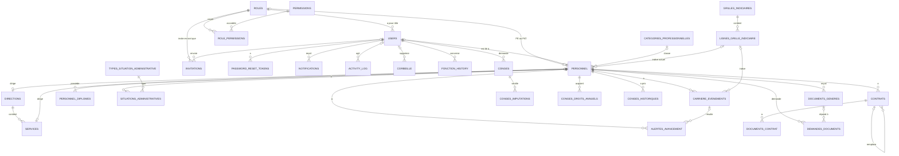

# MCD du SGRH (33 entités)

Modèle validé, établi à partir de la base `rh_mahajanga`, du backend et du frontend actuels.
`schema.sql` le reproduit exactement (32 tables existantes + `ROLES`). Cardinalités (min,max)
déduites des clés étrangères, de leur nullabilité et des contraintes d'unicité ; `[ … ]` = `ON DELETE`.

- `personnel.matricule` : 6 chiffres, unique. Un indice comme `950-FOP` est un **indice**
  (`personnel.indice`, `carriere_evenements.indice`, `lignes_grille_indiciaire.indice`), jamais un matricule.

## Entités par domaine

| Domaine | Entités |
|---|---|
| Accès | `ROLES` (code), `USERS`, `PERSONNEL`, `PERMISSIONS`, `ROLE_PERMISSIONS`, `INVITATIONS`, `OTP_CODES`, `PASSWORD_RESET_TOKENS` |
| Organisation | `DIRECTIONS`, `SERVICES`, `CATEGORIES_PROFESSIONNELLES` |
| Carrière | `CARRIERE_EVENEMENTS`, `PERSONNEL_DIPLOMES`, `FONCTION_HISTORY`, `TYPES_SITUATION_ADMINISTRATIVE`, `SITUATIONS_ADMINISTRATIVES`, `ALERTES_AVANCEMENT`, `PARAMETRES_CARRIERE` (clé `cle`) |
| Indices | `GRILLES_INDICIAIRES`, `LIGNES_GRILLE_INDICIAIRE` |
| Contrats | `CONTRATS`, `DOCUMENTS_CONTRAT` |
| Congés | `CONGES`, `CONGES_DROITS_ANNUELS`, `CONGES_IMPUTATIONS`, `CONGES_HISTORIQUES` |
| Documents | `DOCUMENTS_GENERES`, `DEMANDES_DOCUMENTS` |
| Communication et audit | `NOTIFICATIONS`, `ACTIVITY_LOG`, `CORBEILLE` |
| Configuration | `SITE_SETTINGS` (clé `key`), `SITE_TEXTS` (clé `key`) |

## Associations (extraits significatifs)

| A | Association | B | Card. A | Card. B |
|---|---|---|---|---|
| USERS | est lié à | PERSONNEL | (0,1) | (0,1) |
| ROLES | est le rôle de | USERS / ROLE_PERMISSIONS / INVITATIONS | (1,1) | (0,N) |
| ROLES | est le rôle de | PERSONNEL (PE, PAT) | (0,1) | (0,N) |
| ROLE_PERMISSIONS | accorde | PERMISSIONS | (1,1) | (0,N) |
| SERVICES | dépend de | DIRECTIONS | (1,1) | (0,N) |
| DIRECTIONS / SERVICES | est dirigé par | PERSONNEL | (0,1) | (0,1) |
| PERSONNEL | est classé dans | CATEGORIES_PROFESSIONNELLES | (0,1) | (0,N) |
| CARRIERE_EVENEMENTS, PERSONNEL_DIPLOMES, SITUATIONS_ADMINISTRATIVES, CONTRATS, DOCUMENTS_GENERES, DEMANDES_DOCUMENTS, CONGES_DROITS_ANNUELS, CONGES_HISTORIQUES, ALERTES_AVANCEMENT | concerne | PERSONNEL | (1,1) | (0,N) |
| SITUATIONS_ADMINISTRATIVES | est de type | TYPES_SITUATION_ADMINISTRATIVE | (1,1) | (0,N) |
| LIGNES_GRILLE_INDICIAIRE | appartient à | GRILLES_INDICIAIRES | (1,1) | (0,N) |
| CARRIERE_EVENEMENTS, PERSONNEL | s'appuie sur | LIGNES_GRILLE_INDICIAIRE | (0,1) | (0,N) |
| CONTRATS | remplace | CONTRATS | (0,1) | (0,N) |
| DOCUMENTS_CONTRAT | appartient à | CONTRATS | (1,1) | (0,N) |
| CONGES | est demandé par | USERS | (1,1) | (0,N) |
| CONGES | est avisé / décidé par | USERS | (0,1) | (0,N) |
| CONGES_IMPUTATIONS | ventile | CONGES | (1,1) | (0,N) |
| DEMANDES_DOCUMENTS | produit | DOCUMENTS_GENERES | (0,1) | (0,N) |
| NOTIFICATIONS | est reçue par | USERS | (1,1) | (0,N) |
| FONCTION_HISTORY | concerne | USERS | (1,1) | (0,N) |

Règles portées par la base : une seule situation ouverte (`date_fin IS NULL`) par personnel, un seul
contrat `actif` par personnel, une alerte d'avancement ouverte par (personnel, type), un droit
annuel par (personnel, année).

## Écarts par rapport à la base actuelle (appliqués dans `schema.sql`)

- **B1** table `ROLES` et clés étrangères `users.role`, `personnel.role`, `invitations.role`,
  `role_permissions.role` (remplace le `CHECK users_role_check` et le rôle inutilisé `MESUPRES`).
- **B3** `CHECK` sur `documents_generes.type_document` et `demandes_documents.type_document`.
- **B6** index sur les clés étrangères et les recherches fréquentes.

## Écarts connus non corrigés (les corriger changerait le comportement du backend ou du frontend)

| Écart | Pourquoi laissé tel quel |
|---|---|
| `personnel.service` / `direction` en texte relié par le nom, non par clé étrangère | L'import Excel accepte une saisie libre ; une clé étrangère changerait ce comportement |
| `personnel.type_contrat`, `date_echeance_contrat`, `contrat_permanent`, `notif_echeance_envoyee` doublonnent `contrats` | Utilisés par `personnelRepository`, `carriereRepository`, `personnelService` et les formulaires |
| `carriere_evenements.fonction` sans contrainte de valeurs | Saisie libre dans le formulaire de carrière |
| `conges.user_id` (compte) et non `personnel_id` | Le code de demande, de validation et de corbeille s'appuie sur le compte |
| Liens JSON `documents_generes.donnees.congeId` / `historiqueId`, `conges_imputations.annee`, `otp_codes.email`, `invitations.matricule`, `notifications.lien` | Liens logiques sans clé étrangère, utilisés tels quels par le backend |

Ces points peuvent faire l'objet d'une évolution ultérieure avec adaptation du code et migration
des données existantes (par exemple les fiches dont le service vaut « SI » ou « DSI »).
